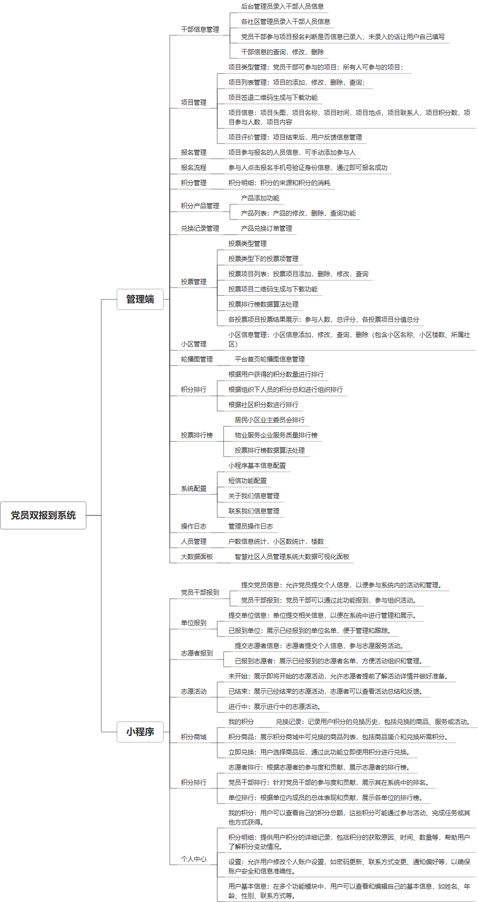

 

    
 

公司拥有上百套具有自主知识产权的软件系统，详情请查看码云首页或公司官网

 
<h1>党员双报到</h1>

<a href="https://www.haishi.net.cn/">公司官网</a> ｜ <a href="https://www.haishi.net.cn/">在线体验</a>

 

## 系统介绍

通过微信小程序，连接党员干部、单位组织和基层群众，基层群众通过小程序表达诉求，党员干部和单位组织认领诉求，做到有求必应，有应必解决；平台将各党员干部以及单位资源进行整合，让资源利用最大化，实现资源共享；通过“双报到·双服务”
通过微信小程序，连接党员干部、单位组织和基层群众，基层群众通过小程序表达诉求，党员干部和单位组织认领诉求，做到有求必应，有应必解决；平台将各党员干部以及单位资源进行整合，让资源利用最大化，实现资源共享；通过“双报到·双服务”
本项目名称为社区党员双报到系统，旨在搭建一个方便社区党员报到、参与志愿服务、记录服务时长、获取积分奖励的平台。
本系统从用户层面至少包含三个端：
- 后台管理端：管理员用户使用，可以进行系统配置、用户管理、数据统计等操作。
- 党员端：社区党员使用，可以进行双报到、报名志愿服务、查看服务记录、使用积分兑换商品等操作。
- 志愿者端：志愿者使用，可以进行注册、报名志愿服务、查看服务记录等操作。
                

## 系统功能介绍

### 系统包含终端说明

管理端（WEB）、用户端（微信小程序）

| 序号 | 模块                   | 模块说明 |
| ---- | ---------------------- | -------- |
| 1    | ZF-ZHDJ-SQDYSBD-MANAGE | 管理端   |
| 2    | ZF-ZHDJ-SQDYSBD-MP     | 小程序   |
| 3    | ZF-ZHDJ-SQDYSBD-SERVER | 服务端   |

### 系统功能结构

### 系统功能说明

- 双报到功能：党员可以在系统中进行双报到，方便社区掌握党员信息。
- 志愿服务功能：系统提供志愿服务项目发布、报名、服务时长记录等功能，方便党员参与志愿服务。
- 积分商城功能：系统设置积分奖励机制，党员参与志愿服务可以获得积分，并使用积分兑换商品，提高党员参与积极性。

## 系统主要界面

## 系统技术说明

### 代码模块说明

| 序号 | 目录 | 目录说明 |
| ---- | ---- | -------- |

### 系统技术选型

#### 开发语言/框架

JAVA（JDK1.8）
前端框架：VUE2

#### 服务中间件

Nginx
Tomcat

#### 数据库

MySQL（5.7+）
Redis

#### 其他说明

无

## 系统演示/商用

请扫码添加客服微信获取演示地址和系统详细资料。

如果您想基于党员双报到进行商业化交付或定制开发服务，我们提供有偿的技术服务支持，合作模式不限，欢迎沟通！

公司官网地址： <a href="https://www.haishi.net.cn/">https://www.haishi.net.cn</a>

联系客服获取专业回答。

## 使用须知

1、 本项目商用必须获得版权所有者的授权。

2、 未经允许本项目代码不允许二次出售。

